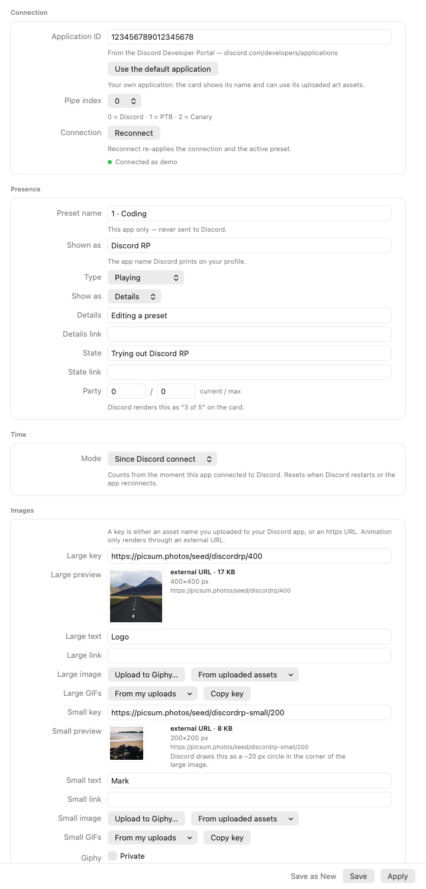
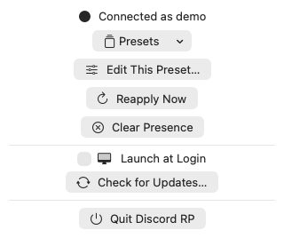

# Discord RP

[](https://github.com/quangpao/discord-rp-mac/actions/workflows/ci.yml)
[](https://github.com/quangpao/discord-rp-mac/releases/latest)
[](LICENSE)


A native macOS menu bar app that sets a **custom Discord Rich Presence**: your activity, images, an
elapsed timer and up to two link buttons, kept alive while you work. Written from scratch in Swift
(SwiftUI + AppKit) — a ~2 MB app bundle, no Electron, no runtime to install.



## Features

- **Full activity editor** — type, display type, name, details and state with links, party size, five
  timestamp modes, large/small images with text and link, up to two buttons.
- **Named presets**, switched from the menu bar; image keys are listed from your own Discord
  application.
- **Keeps the presence alive** — 15 s keepalive, backoff 2/5/10/30 s, reconnects after sleep, clears
  the presence when you quit.
- **Menu bar only** (`LSUIElement`, no Dock icon), single instance, optional launch at login.
- **Discord's own limits enforced up front**, with readable reasons instead of silent failures.
- **No telemetry, no account, no bundled keys** — presence travels over the local Discord IPC socket.

## Requirements

- macOS 14 or later
- The **Discord desktop app**, running
- To build from source: a Swift 6 toolchain (Xcode 16+ or the Command Line Tools) and `git`

## Install

**Download** — take the `.dmg` from [Releases](https://github.com/quangpao/discord-rp-mac/releases/latest)
and drag the app to Applications. The build is **not notarized**, so macOS will refuse the first
launch: open it once, then allow it in **System Settings → Privacy & Security → Open Anyway**
(or `xattr -dr com.apple.quarantine "/Applications/Discord RP.app"`).

**Build from source** — no Gatekeeper involvement:

```bash
git clone https://github.com/quangpao/discord-rp-mac
cd discord-rp-mac
./scripts/build-app.sh --install --run
```

## Configure

1. Create an application at <https://discord.com/developers/applications> and copy its
   **Application ID**. It is *your* application, so name it whatever you like — the portal steps,
   including the image assets, are in [docs/discord-setup.md](docs/discord-setup.md).
2. In the app: menu bar → **Edit This Preset…** → **Connection → Apply**. That is what pushes the
   activity to Discord, and it also recovers when Discord restarts.
3. Optionally upload images under the application's *Art Assets* and use their names as image keys,
   or paste an https image URL directly (Discord's external-image budget is 256 characters).



## Images and your Giphy key

The app ships **no API keys**. The *Upload to Giphy…* buttons work with your own free Giphy key:
create one at <https://developers.giphy.com/dashboard/?create=true>, then paste it in
**Edit This Preset… → “Giphy — bring your own key” → Save to Keychain**.

| Looked up in this order | Set by |
| --- | --- |
| macOS Keychain (`dev.quangpao.discordrp.giphy`) | the app, from the field above |
| `$GIPHY_API_KEY` | your shell or CI |
| `~/.giphy/api_key` | a hand-written file, for scripting |

The key is never logged, never written into this repository and never shown back — the UI only reports
which source supplied it. Uploads use **your** Giphy account, are public unless you tick *Private on
Giphy*, and a dashboard key allows 10 uploads per day. The app keeps a local history of its uploads
because Giphy's API cannot list them.

## Troubleshooting

| Symptom | Cause / fix |
| --- | --- |
| Status stays red, or "Invalid Client ID" | Wrong Application ID, or Discord is not running. |
| The activity does not show, but a game does | Discord shows one activity in the compact slot and auto-detected games win. Open your own profile to see the Rich Presence. |
| My buttons are invisible | By Discord's design, buttons are shown only to *other* users — never to the account that set them. |
| The asset list is empty | Assets are per-application: upload them under *Art Assets* in the portal, then press *Load from Discord*. |
| *Upload to Giphy…* is greyed out | No Giphy key yet — that is deliberate. Add yours in the *Giphy* card. |
| Giphy upload fails with 401/403 / 429 | The key was revoked or is wrong / the 10-uploads-per-day quota is used up. |
| An animated image key shows a still frame | Discord animates GIF/MP4 keys only in some clients; use a Giphy URL or an uploaded asset. |
| Nothing happens after sleep | The app reasserts the socket on wake; press *Reconnect* if Discord restarted while asleep. |

## Uninstall

```bash
# quit the app first (menu bar → Quit), then:
rm -rf "/Applications/Discord RP.app"
rm -rf "$HOME/Library/Application Support/DiscordRPMac" "$HOME/Library/Logs/DiscordRP"
security delete-generic-password -s dev.quangpao.discordrp.giphy -a api-key 2>/dev/null || true
```

Also remove it from **System Settings → General → Login Items** if you enabled launch at login.

## Limitations

- Around 75 MB resident. That is the SwiftUI/AppKit baseline, not a leak; getting under 30 MB would
  mean rebuilding the menu with a raw `NSStatusItem`/`NSMenu`.
- The name and icon on the activity card come from *your* Discord application — the app only fills the
  fields Discord exposes.
- Party size, secrets and game auto-detection are intentionally out of scope.

## Development

```bash
swift build && swift test         # unit tests (needs the Xcode-selected toolchain)
./scripts/build-app.sh --dmg      # → build/DiscordRP-<version>.dmg, prints size + sha256
./scripts/bump-version.sh 1.0.1   # bump both version files before tagging
```

Conventions, the headless CLI flags and how the screenshots in this file are regenerated:
[CONTRIBUTING.md](CONTRIBUTING.md).

## Documentation

| | |
| --- | --- |
| [docs/architecture.md](docs/architecture.md) | module map, and the protocol findings that shaped the code |
| [docs/discord-setup.md](docs/discord-setup.md) | Discord Developer Portal walkthrough, art assets, image hosting |
| [docs/release.md](docs/release.md) | versioning, tagging, signing and notarization |
| [docs/ui/README.md](docs/ui/README.md) | logo assets, icon pipeline, design artifacts |
| [SECURITY.md](SECURITY.md) | what is stored, what is sent, how to report a problem |
| [THIRD_PARTY_NOTICES.md](THIRD_PARTY_NOTICES.md) | attribution and disclaimers |

## Privacy

No telemetry, no analytics, no auto-update and no server run by this project. Rich Presence goes over
the local Discord IPC socket; the only network calls are the ones you trigger — listing your own
application's assets, loading an image preview, and uploading to Giphy with your key. What is stored,
and where, is listed in [SECURITY.md](SECURITY.md).

## License

MIT — see [LICENSE](LICENSE). Not affiliated with Giphy or Discord; see
[THIRD_PARTY_NOTICES.md](THIRD_PARTY_NOTICES.md).
